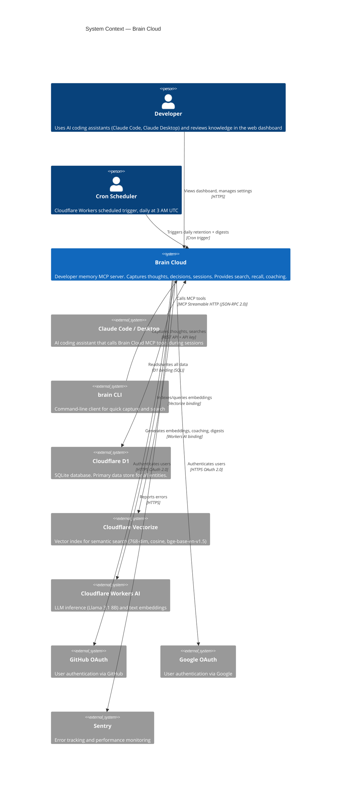
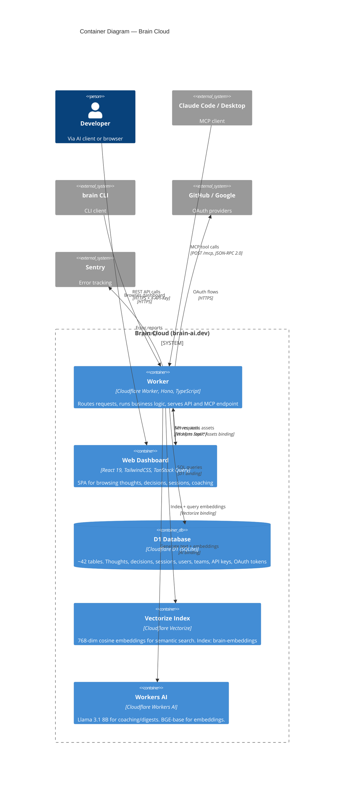
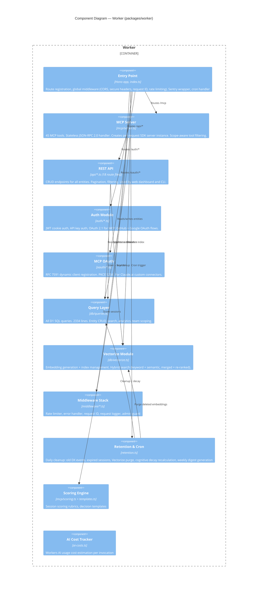
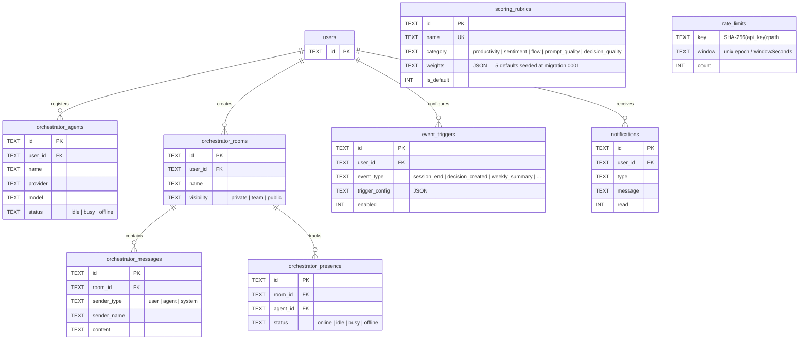
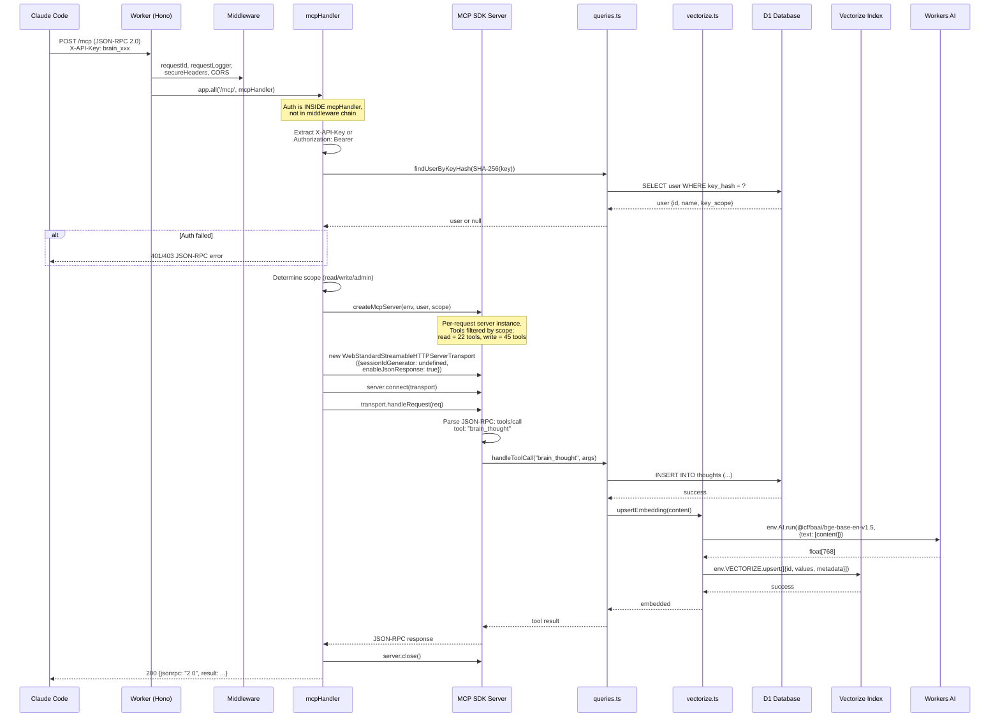
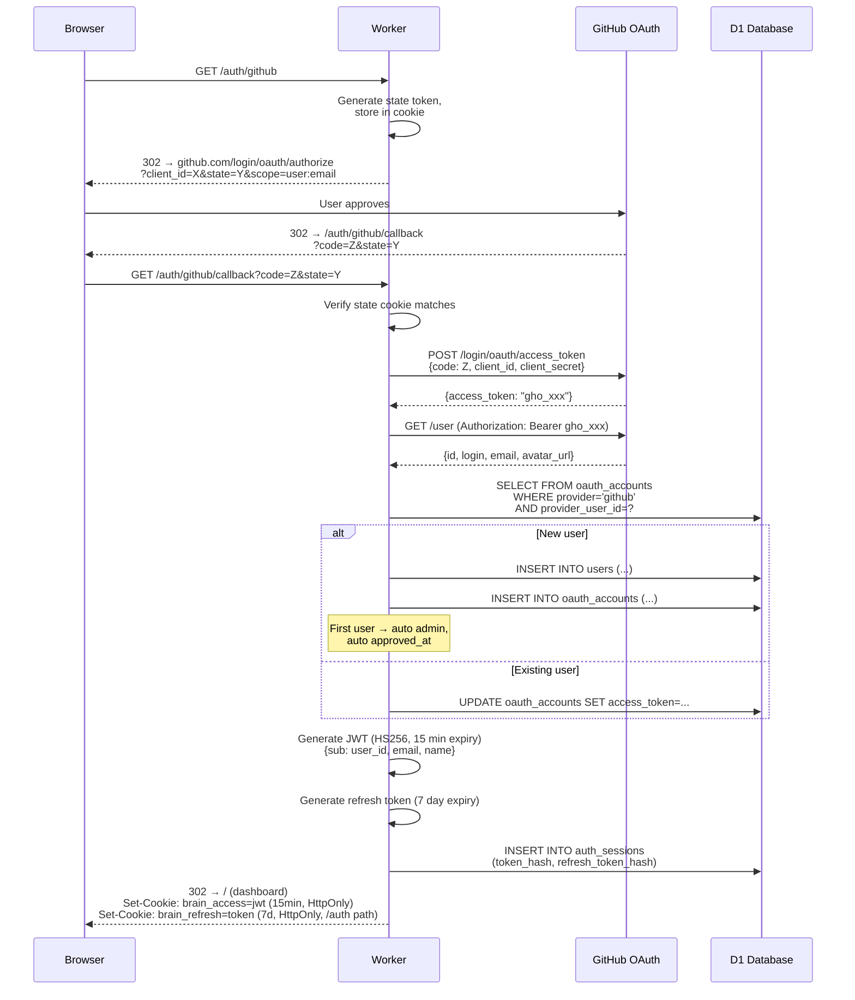
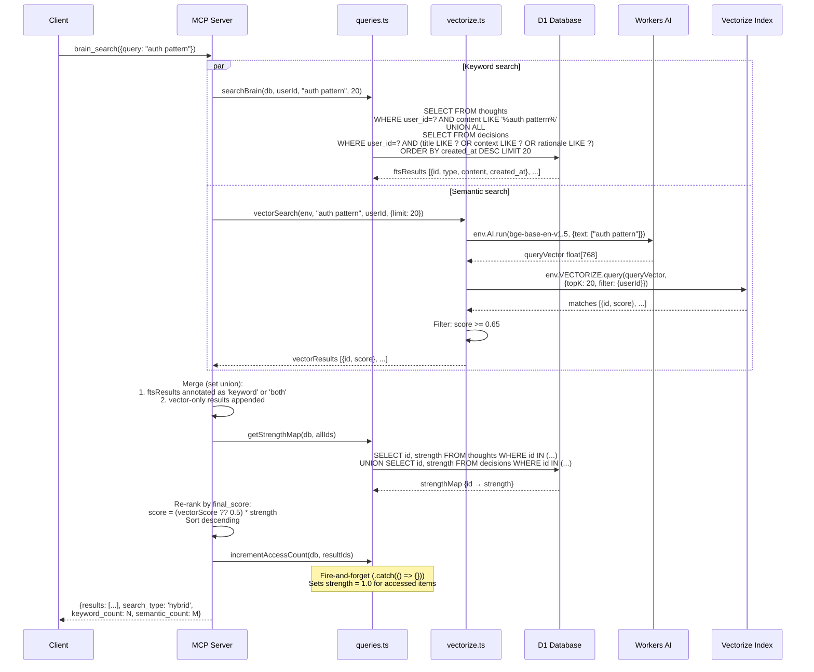

# Architecture: Brain Cloud

## Overview

Brain Cloud is a **developer memory MCP server** — it captures thoughts, decisions, work sessions, and sentiment from AI-assisted workflows and makes them searchable and actionable. It runs as a single Cloudflare Worker serving three interfaces: an MCP endpoint for AI clients (Claude Code, Claude Desktop), a REST API for the web dashboard, and the React SPA dashboard itself.

The system is designed for a single developer (self-hosted) or small teams. It is not a multi-tenant SaaS platform. The primary consumers are AI coding assistants that call Brain Cloud's 45 MCP tools during conversations.

## Concept Brief

- **System**: Brain Cloud
- **Purpose**: Persistent memory for AI coding sessions — capture, search, and recall thoughts and decisions across projects.
- **Actors**: Developer (via AI client), Developer (via web dashboard), Developer (via CLI), Cron scheduler
- **External Systems**: Cloudflare D1, Cloudflare Vectorize, Cloudflare Workers AI, GitHub OAuth, Google OAuth, Sentry
- **Key Responsibilities**: Record thoughts/decisions/sessions, semantic + keyword search, cognitive memory decay, AI-generated coaching/digests, cross-project context handoffs
- **Out of Scope**: Chat UI, LLM routing, multi-MCP orchestration (these were explored and intentionally excluded)
- **Tech Constraints**: Cloudflare Workers (TypeScript), D1 (SQLite), no persistent connections, stateless per-request
- **Quality Priorities**: 1. Simplicity/Maintainability, 2. Availability/Reliability, 3. Cost efficiency

---

## C4 Model

### Level 1: System Context

Brain Cloud sits between AI coding clients and Cloudflare's infrastructure services. The developer rarely interacts with Brain Cloud directly — instead, their AI assistant calls MCP tools on their behalf during coding sessions. The web dashboard is for browsing and reviewing accumulated knowledge.



**Actors:**

| Actor | Type | Interaction |
|-------|------|-------------|
| Developer (via AI client) | Person | Calls 45 MCP tools through Claude Code / Claude Desktop |
| Developer (via dashboard) | Person | Browses thoughts, decisions, sessions in the React SPA |
| Developer (via CLI) | Person | Quick capture (`brain think`) and search (`brain search`) |
| Cron Scheduler | System | Daily at 3 AM UTC: retention cleanup, cognitive decay, weekly digests |

**Key Decisions:**
1. **Single Cloudflare Worker for everything**: MCP, REST API, and SPA are all served from one Worker. Simpler deployment and lower cost than separate services.
2. **MCP as primary interface**: The system is designed to be consumed by AI clients, not humans. The dashboard is secondary.
3. **Stateless MCP**: Each MCP request creates a fresh SDK server instance. No session management. Works naturally with CF Workers' request-per-invocation model.

---

### Level 2: Containers

The system is a single deployable Worker, but internally it has distinct functional areas. The React SPA is a separate build artifact served via Workers Static Assets.



**Containers:**

| Container | Technology | Responsibility |
|-----------|------------|----------------|
| Worker | Hono 4.7, TypeScript, CF Worker | Routes all requests. Serves MCP endpoint, REST API, OAuth flows, cron handler. Single entry point. |
| Web Dashboard | React 19, Tailwind v4, TanStack Query, Radix UI | SPA for browsing/managing knowledge. 20+ pages. Built with Vite, served as static assets. |
| D1 Database | Cloudflare D1 (SQLite) | ~42 tables across 17 migrations. All entities: thoughts, decisions, sessions, users, teams, etc. |
| Vectorize Index | Cloudflare Vectorize | Semantic search. 768-dimension cosine similarity. Embeddings generated by Workers AI. |
| Workers AI | Cloudflare Workers AI | Two models: Llama 3.1 8B (text generation for coaching/digests) and BGE-base-en-v1.5 (embeddings). |

**Communication:**

| From | To | Protocol | Pattern | Notes |
|------|-----|----------|---------|-------|
| Worker | D1 | D1 binding (SQL) | Sync | All queries go through `db/queries.ts` (2334 lines) |
| Worker | Vectorize | Vectorize binding | Sync | Index on write, query on search. `db/vectorize.ts` |
| Worker | Workers AI | AI binding | Sync | Embedding generation + LLM inference |
| Worker | SPA | Workers Static Assets | Sync | SPA fallback: any unmatched route serves `index.html` |
| SPA | Worker | fetch() | Async | TanStack Query hooks call `/api/*` endpoints |

**Key Decisions:**
1. **Monolith Worker**: No microservices. One Worker handles MCP, REST, OAuth, cron, and SPA serving. This is intentional — the system doesn't need the complexity of multiple services.
2. **D1 over Postgres/Turso**: D1 is free for low-traffic use, co-located with the Worker, and supports SQL. The tradeoff is SQLite limitations (no JSONB, no full-text search natively — FTS is done via LIKE queries and Vectorize).
3. **Workers AI over external LLMs**: Coaching, digests, and embeddings use Cloudflare's hosted models instead of Anthropic/OpenAI. Much cheaper (included in Workers plan) at the cost of quality (Llama 3.1 8B vs Claude).

---

### Level 3: Components — Worker

The Worker is structured around Hono route groups, with shared middleware and a data layer.



**Components:**

| Component | Type | Responsibility | Key Files |
|-----------|------|----------------|-----------|
| Entry Point | Router | Hono app setup, middleware chain, route registration, Sentry wrap, cron dispatch | `index.ts` (158 lines) |
| MCP Server | Protocol Handler | 45 tool definitions + handlers. Per-request stateless SDK server. Scope-aware (read/write/admin) tool filtering. | `mcp/server.ts` (1896 lines) |
| REST API | Controllers | 18 route groups. CRUD for thoughts, decisions, sessions, etc. Pagination, filtering, team scoping. | `api/*.ts` (24 files) |
| Auth Module | Middleware + Routes | JWT generation/verification, API key hashing, GitHub/Google OAuth callbacks, key management UI | `auth/*.ts` (4 files, ~850 lines) |
| MCP OAuth | Protocol Handler | OAuth 2.1 for MCP clients. Dynamic client registration, PKCE, consent page, token management. | `oauth/*.ts` (5 files, ~700 lines) |
| Query Layer | Data Access | All D1 SQL. Every entity has list/get/create/update/delete. Team scoping. Analytics aggregations. | `db/queries.ts` (2334 lines) |
| Vectorize Module | Search Engine | Embedding generation (Workers AI), Vectorize index ops, hybrid search (keyword FTS + semantic, merged re-ranking). | `db/vectorize.ts` |
| Middleware Stack | Cross-cutting | Rate limiter (per-user, per-endpoint), error handler (Sentry integration), request ID, request logger, admin guard | `middleware/*.ts` (5 files) |
| Retention & Cron | Scheduler | Daily at 3 AM UTC. 7 tasks: cleanup old data, purge vectors, recalculate cognitive decay, generate weekly digests. | `retention.ts` (178 lines) |
| Scoring Engine | Business Logic | Session quality scoring rubrics, decision templates for guided decision-making. | `mcp/scoring.ts`, `mcp/templates.ts` |
| AI Cost Tracker | Telemetry | Estimates Workers AI costs per invocation (embedding, generation) for DX analytics. | `ai-costs.ts` |

**Interfaces:**

| Interface | Methods / Endpoints | Consumed By |
|-----------|---------------------|-------------|
| MCP (JSON-RPC) | `tools/list`, `tools/call` (45 tools) | Claude Code, Claude Desktop, any MCP client |
| REST API | GET/POST/PATCH/DELETE on 18 route groups | Web Dashboard, CLI |
| OAuth 2.1 | `/oauth/register`, `/oauth/authorize`, `/oauth/token` | Claude.ai custom connectors |
| Auth | `/auth/github`, `/auth/google`, `/auth/me`, `/auth/api-key` | Web Dashboard, CLI |

**Key Decisions:**
1. **MCP tools call queries.ts directly**: No HTTP round-trip. The MCP handler imports the query layer and calls functions. This is only possible because everything runs in one Worker.
2. **Hybrid search**: Keyword search (SQL LIKE) and semantic search (Vectorize) are run in parallel, results are merged and re-ranked by a scoring function that considers keyword match, semantic similarity, and memory strength (cognitive decay).
3. **Scope-aware MCP**: API keys have scopes (read/write/admin). The MCP server filters available tools based on scope — read-scoped keys only see 22 of 45 tools.

---

## Key Architectural Decisions

| # | Decision | Chosen | Rationale | Alternatives Considered |
|---|----------|--------|-----------|------------------------|
| 1 | Deployment model | Single CF Worker monolith | One deployable unit. No service mesh, no inter-service communication. Free tier covers solo dev usage. | Separate Workers per concern (would need Service Bindings, more complexity) |
| 2 | Database | Cloudflare D1 (SQLite) | Free, co-located, SQL-compatible. ~42 tables fit in D1's limits. | Turso (more features, costs money), Postgres via Neon/Supabase (overkill) |
| 3 | Vector search | Cloudflare Vectorize | Integrated with Workers. No external API calls. BGE-base embeddings are decent for this use case. | Pinecone (better quality, costs money), pgvector (needs Postgres) |
| 4 | LLM for coaching | Workers AI (Llama 3.1 8B) | Free/cheap. Coaching and digests don't need Claude-quality output. | Anthropic API (better quality, $$$), OpenAI (same tradeoff) |
| 5 | MCP protocol | Stateless per-request, JSON response mode | CF Workers are stateless. No SSE persistence needed — all tool calls complete synchronously. | SSE streaming (unnecessary for this use case), WebSocket (not supported in Workers) |
| 6 | Auth model | JWT cookies (dashboard) + API key hash (MCP/CLI) + OAuth 2.1 (Claude.ai) | Three interfaces need three auth methods. JWT for browser sessions, API keys for programmatic access, OAuth for standard MCP clients. | Single auth method (wouldn't cover all use cases) |
| 7 | Cognitive decay | Memory strength column, daily cron recalculation | Memories fade over time unless accessed. Encourages review. Simple exponential decay recalculated daily. | No decay (flat memory), access-based only (no time component) |
| 8 | Frontend framework | React 19 SPA served as Workers Static Assets | Standard, well-known. Static assets are free on CF. No SSR needed — dashboard is internal tool. | SvelteKit (lighter), Astro (overkill for SPA), no frontend (MCP-only) |

---

## Quality Attributes

| Attribute | How Addressed |
|-----------|---------------|
| **Simplicity** | Single Worker, single DB, no microservices. ~32K lines of TypeScript total. One `wrangler deploy`. |
| **Availability** | Cloudflare Workers global edge deployment. D1 auto-replication. No single point of failure beyond Cloudflare itself. |
| **Cost** | Free tier covers solo dev: D1 (5M reads/day), Workers (100K req/day), Workers AI (10K neurons/day). $0/month for normal usage. |
| **Latency** | Worker runs at edge. D1 queries are fast (SQLite). Vectorize queries add ~50-100ms. Workers AI adds ~200-500ms (only for coaching/digests, not hot path). |
| **Security** | API keys hashed with SHA-256. JWT signed with HS256. OAuth PKCE S256. Scope-based access control. GDPR deletion cascade. Rate limiting (implemented but currently disabled). |
| **Maintainability** | 4 packages in monorepo. Strict TypeScript. CI runs lint + typecheck + tests. Staging env for pre-prod validation. |

---

## Risks & Mitigations

| Risk | Impact | Likelihood | Mitigation |
|------|--------|------------|------------|
| D1 query limit exceeded (5M/day free) | Service degraded | Low (solo dev use) | Monitor via DX analytics. Upgrade to paid plan if needed ($5/mo). |
| Workers AI quality too low for coaching | Poor insight quality | Medium | Coaching is advisory, not critical. Can swap to external LLM later without arch changes. |
| Vectorize index size limit | Search degraded | Low (10M vectors on free) | Prune old, low-strength memories via cognitive decay. |
| Single Worker timeout (30s) | Long operations fail | Low | All DB ops are fast. AI calls are the bottleneck (~500ms). No single operation approaches 30s. |
| OAuth token compromise | Unauthorized MCP access | Low | Tokens are short-lived (1h access, 30d refresh). Scoped to specific operations. Revocation supported. |

---

## Data Model (Entity Relationship Diagrams)

~42 tables across 17 migrations. All IDs are TEXT (UUIDs). All timestamps are ISO 8601 TEXT. Arrays and objects stored as JSON TEXT. Split into three diagrams by domain — a single diagram would exceed most Mermaid renderers' entity limits.

### ERD 1 — Core: Identity, Brain Entities & Analytics

The main domain: who uses the system, what they capture, and how sessions are measured.

```mermaid
erDiagram
    users {
        TEXT id PK
        TEXT name
        TEXT email UK
        TEXT system_role "user | admin | super_admin"
        INT is_active
        TEXT approved_at "waitlist gate (migration 0011)"
    }

    machines {
        TEXT id PK
        TEXT user_id FK
        TEXT hostname
        TEXT os
        TEXT arch
    }

    projects {
        TEXT id PK
        TEXT user_id FK "added migration 0012"
        TEXT team_id "implicit FK, nullable"
        TEXT name
        TEXT visibility "private | team | public"
    }

    thoughts {
        TEXT id PK
        TEXT user_id FK
        TEXT machine_id FK
        TEXT project_id FK
        TEXT type "note | idea | question | todo | insight"
        TEXT content
        TEXT tags "JSON array"
        TEXT visibility "private | team | public"
        REAL strength "0.05-1.0 (cognitive decay)"
        INT access_count "default 0"
        TEXT last_accessed_at
        TEXT deleted_at "soft delete"
    }

    decisions {
        TEXT id PK
        TEXT user_id FK
        TEXT project_id FK
        TEXT title
        TEXT options "JSON array"
        TEXT chosen
        TEXT rationale
        TEXT outcome
        REAL strength "0.05-1.0 (cognitive decay)"
        INT access_count
        TEXT deleted_at "soft delete"
    }

    decision_reviews {
        TEXT id PK
        TEXT decision_id FK
        TEXT user_id FK
        TEXT review_type "follow_up | retrospective | validation"
        TEXT outcome_rating "positive | neutral | negative | too_early"
        INT would_decide_same
        TEXT next_review_at
    }

    sessions {
        TEXT id PK
        TEXT user_id FK
        TEXT project_id FK
        TEXT mood_start
        TEXT mood_end
        TEXT goals "JSON array"
        TEXT accomplishments "JSON array"
        TEXT summary
        TEXT started_at
        TEXT ended_at
    }

    session_scores {
        TEXT id PK
        TEXT session_id FK "unique — 1:1 with sessions"
        REAL productivity_score
        REAL sentiment_score
        REAL flow_score
        REAL overall_score
        TEXT breakdown "JSON"
        TEXT coaching_insights
    }

    sentiment {
        TEXT id PK
        TEXT user_id FK
        TEXT target_type "tool | library | pattern | codebase | task | process"
        TEXT target_name
        TEXT feeling "frustrated | confused | satisfied | excited | neutral | annoyed | impressed"
        INT intensity "1-5"
    }

    handoffs {
        TEXT id PK
        TEXT user_id FK
        TEXT from_project
        TEXT to_project
        TEXT message
        TEXT handoff_type "context | decision | blocker | task"
        TEXT priority "low | medium | high | urgent"
        TEXT claimed_at
    }

    reminders {
        TEXT id PK
        TEXT user_id FK
        TEXT project_id FK
        TEXT content
        TEXT due_at
        TEXT status "pending | completed | dismissed"
    }

    conversations {
        TEXT id PK
        TEXT user_id FK
        TEXT session_id FK
        TEXT prompt_text
        TEXT response_summary
        INT turns
        REAL quality_score
    }

    dx_events {
        TEXT id PK
        TEXT user_id FK
        TEXT event_type "command | tool_use | completion | error"
        TEXT command
        INT duration_ms
        INT tokens_in
        INT tokens_out
        INT success
    }

    dx_costs {
        TEXT id PK
        TEXT user_id FK
        TEXT date
        TEXT model
        REAL cost_usd
    }

    users ||--o{ machines : "owns"
    users ||--o{ projects : "owns"
    users ||--o{ thoughts : "creates"
    users ||--o{ decisions : "makes"
    users ||--o{ sessions : "tracks"
    users ||--o{ sentiment : "records"
    users ||--o{ handoffs : "creates"
    users ||--o{ reminders : "sets"
    users ||--o{ dx_events : "generates"
    users ||--o{ dx_costs : "tracks"
    projects ||--o{ thoughts : "scoped to"
    projects ||--o{ decisions : "scoped to"
    projects ||--o{ sessions : "scoped to"
    decisions ||--o{ decision_reviews : "reviewed by"
    sessions ||--o| session_scores : "scored as"
    sessions ||--o{ conversations : "contains"
```



### ERD 2 — Auth, Teams & MCP OAuth

Three authentication methods, team access control, and the OAuth 2.1 flow for MCP clients (Claude.ai).

```mermaid
erDiagram
    users {
        TEXT id PK
    }

    oauth_accounts {
        TEXT id PK
        TEXT user_id FK
        TEXT provider "github | google"
        TEXT provider_user_id
        TEXT access_token
    }

    auth_sessions {
        TEXT id PK
        TEXT user_id FK
        TEXT token_hash UK "SHA-256 of JWT"
        TEXT refresh_token_hash UK
        TEXT expires_at "15 min access / 7 day refresh"
    }

    api_keys {
        TEXT id PK
        TEXT user_id FK
        TEXT key_hash UK "SHA-256 of raw key"
        TEXT name
        TEXT scope "read | write | admin"
        TEXT expires_at
    }

    teams {
        TEXT id PK
        TEXT name
        TEXT slug UK
        TEXT created_by FK
    }

    team_members {
        TEXT id PK
        TEXT team_id FK
        TEXT user_id FK
        TEXT role "member | admin | owner"
    }

    team_invites {
        TEXT id PK
        TEXT team_id FK
        TEXT email
        TEXT token UK
        TEXT expires_at
    }

    project_members {
        TEXT id PK
        TEXT project_id FK
        TEXT user_id FK
        TEXT team_id FK
        TEXT role "viewer | contributor | admin"
    }

    oauth_clients {
        TEXT id PK
        TEXT client_id UK "RFC 7591 dynamic registration"
        TEXT client_secret_hash
        TEXT redirect_uris "JSON array"
        TEXT client_name
    }

    oauth_authorization_codes {
        TEXT id PK
        TEXT code_hash UK
        TEXT client_id FK
        TEXT user_id FK
        TEXT code_challenge "PKCE S256"
        TEXT scope "mcp:read | mcp:write"
        TEXT expires_at
    }

    oauth_tokens {
        TEXT id PK
        TEXT access_token_hash UK "prefix: bro_"
        TEXT refresh_token_hash UK "prefix: brr_"
        TEXT client_id FK
        TEXT user_id FK
        TEXT scope
        TEXT expires_at "1h access / 30d refresh"
    }

    users ||--o{ oauth_accounts : "linked via"
    users ||--o{ auth_sessions : "has active"
    users ||--o{ api_keys : "manages"
    teams ||--o{ team_members : "has"
    teams ||--o{ team_invites : "sends"
    users ||--o{ team_members : "belongs to"
    oauth_clients ||--o{ oauth_authorization_codes : "issues"
    oauth_clients ||--o{ oauth_tokens : "issues"
    users ||--o{ oauth_tokens : "authorized via"
```



### ERD 3 — Orchestrator, System & Infrastructure

Multi-agent orchestration (migration 0017), system configuration, and infrastructure tables.



> **Dead schema**: The `connections` table (thought↔decision↔session graph links, migration 0001) exists in D1 but is **never queried anywhere** — not in `queries.ts`, no API route, no MCP tool. It is planned infrastructure for a knowledge graph that was never implemented. Omitted from diagrams above.

### Tenant isolation boundary

Every user-owned table has `user_id` FK to `users(id) ON DELETE CASCADE`. All queries include `WHERE user_id = ?`. There is no database-level RLS — isolation is enforced in application code.

**The one exception**: team-scoped reads on `GET /api/thoughts?team_id=X` join through `team_members` to return thoughts from all team members. The `visibility` column exists but is **not enforced** in this query — a team member sees all thoughts from other members including those marked `private`.

---

## Sequence Diagrams

### MCP Tool Call Flow

The complete request lifecycle for an MCP tool invocation (e.g., Claude Code calling `brain_thought`):



### Auth Flow (Dashboard Login)



### Hybrid Search Flow



---

## Non-Obvious Internals

### Cognitive Decay

Memories fade over time unless accessed. This is the core differentiator of Brain Cloud — it incentivizes reviewing old decisions and surfaces what's being forgotten.

**Formula** (`db/queries.ts:1926-1967`, `computeStrength`):

```
For age < 3 days:   strength = e^(-lambda * age_days)              (exponential)
For age >= 3 days:  strength = e^(-lambda * 3) * (age_days/3)^(-beta)  (power law)

+ recency_boost:    if accessed within 7 days, add up to +0.30 (linear decay to 0)

Clamped to [0.05, 1.0]
```

Based on Wixted 1991 — early forgetting is exponential, long-term forgetting follows a power law.

**Constants:**

| Parameter | Normal memory | LTP (access_count >= 10) |
|-----------|---------------|--------------------------|
| lambda (exponential rate) | **0.693** (half-life ~1 day) | **0.347** (half-life ~2 days) |
| beta (power-law exponent) | **0.5** | **0.3** (slower long-term decay) |
| LTP activation threshold | -- | **10 accesses** |
| Recency boost max | **+0.30** | **+0.30** |
| Strength floor | **0.05** | **0.05** |

**What "access" means**: Calling `brain_search`, `brain_recall`, or any tool that returns a thought/decision increments `access_count` by 1, sets `last_accessed_at = now`, and **hard-resets `strength` to 1.0**. This is intentional — accessing a memory fully refreshes it.

**Daily cron** (`retention.ts:124-131`): At 3 AM UTC, `recalculateStrength` iterates all non-deleted thoughts and decisions with `strength > 0.06` in batches of 500 (keyset pagination). It recomputes `strength` using `computeStrength()` and batch-updates D1. Rows already at the floor (0.05) are skipped to save reads.

**Practical effect at different ages (normal memory, no access):**

| Age | Strength | Bucket |
|-----|----------|--------|
| 0 days | 1.00 | Strong |
| 1 day | 0.50 | Moderate |
| 3 days | 0.13 | Fading |
| 7 days | 0.08 | Fading |
| 30 days | 0.05 | Dormant (floor) |

### Hybrid Search Ranking

Search runs two strategies in parallel and merges them.

**Keyword search** (`queries.ts:847-862`): `LIKE '%query%'` against `thoughts.content` and `decisions.title/context/rationale`. Not true FTS — no stemming, no relevance scoring. Results ordered by `created_at DESC`.

**Semantic search** (`vectorize.ts:54-77`): Query text is embedded via `@cf/baai/bge-base-en-v1.5` (768-dim), then searched against Vectorize with cosine similarity. Results with score < **0.65** are filtered out. User-scoped via Vectorize metadata filter `{userId}`.

**Merge strategy**: Set union with deduplication. Keyword hits come first (tagged `'keyword'` or `'both'`), then vector-only hits are appended and tagged `'semantic'`.

**Re-ranking formula**:
```
final_score = (vector_score || 0.5) * memory_strength
```

Keyword-only hits get a synthetic vector score of **0.5**, which means a fresh keyword hit (strength 1.0) scores 0.5, while a semantic hit with cosine 0.7 and strength 1.0 scores 0.7. **Semantic results are inherently favored over keyword-only results.** But a keyword hit with strength 1.0 beats a semantic hit with strength < 0.71.

**Graceful degradation**: If Vectorize or Workers AI bindings are unavailable, vector search returns `[]` and the system falls back to keyword-only. The response includes `search_type: 'keyword'` vs `'hybrid'`.

**Known issue**: `brain_recall` (server.ts:879) has a TODO comment indicating it fetches ALL user thoughts instead of filtering by the found IDs, then does client-side filtering.

### Team Scoping

**Not row-level security.** All tenant isolation is application-level `WHERE user_id = ?`.

**How it works**: The `GET /api/thoughts` endpoint accepts an optional `team_id` query parameter. When provided:

1. Verify the requesting user is a member of the team via `getTeamMember(db, teamId, userId)` — returns 403 if not.
2. Instead of `WHERE t.user_id = ?`, the query does `JOIN team_members tm ON t.user_id = tm.user_id WHERE tm.team_id = ?` — returning thoughts from ALL team members.

**What's scoped**: Only `GET /api/thoughts`. Nothing else — not decisions, not sessions, not search, not recall. The MCP tools are all strictly single-user.

**Visibility gap**: The `visibility` column (`private`/`team`/`public`) exists on thoughts, decisions, sessions, and sentiment, but the team query **does not filter by it**. A team member sees all thoughts from other members including those marked `private`. The visibility column is stored but not enforced.

**Team roles**: `owner`, `admin`, `member` — but no role-based distinction in the read query. Any team member sees everything.

### Rate Limiting

**Currently disabled.** All rate limiter middleware imports and `.use()` calls are commented out in `index.ts:15,59,63,78-79`.

**Algorithm** (if enabled): Fixed-window counter stored in D1 `rate_limits` table. `INSERT ... ON CONFLICT DO UPDATE SET count = count + 1` (atomic upsert).

**Configured limits:**

| Preset | Limit | Window | Key |
|--------|-------|--------|-----|
| API | 100 req | 60 sec | SHA-256(api_key) + path |
| AI (`/api/ask`) | 20 req | 60 sec | SHA-256(api_key) + path |
| Auth | 10 req | 300 sec | IP + path |

**Key details**:
- Per-path granularity: `/api/thoughts` and `/api/decisions` have independent counters. Effective limit is 100/min *per endpoint*, not total.
- Fail-open: If the D1 query fails, the request proceeds.
- Increment-then-check: The D1 upsert increments count before returning, then the check `current > limit` fires. This means exactly `limit` requests are allowed per window (not `limit + 1`).
- Cleanup: The daily cron purges rate limit rows older than 1 hour.

---

## Glossary

| Term | Definition |
|------|-----------|
| **MCP** | Model Context Protocol. JSON-RPC 2.0 based protocol for AI tool use. |
| **Thought** | A captured note, idea, question, todo, or insight from a dev session. |
| **Decision** | A recorded architectural or technical decision with options, rationale, and outcome. |
| **Session** | A tracked work session with goals, accomplishments, and mood. |
| **Cognitive Decay** | Memory strength decreases over time (exponential decay). Accessing a memory resets its strength. |
| **Handoff** | Context passed between projects or sessions for continuity. |
| **Hybrid Search** | Keyword (SQL LIKE) + semantic (Vectorize cosine) search, merged and re-ranked. |
| **DX Event** | Developer experience telemetry (command runs, tool uses, errors). |
